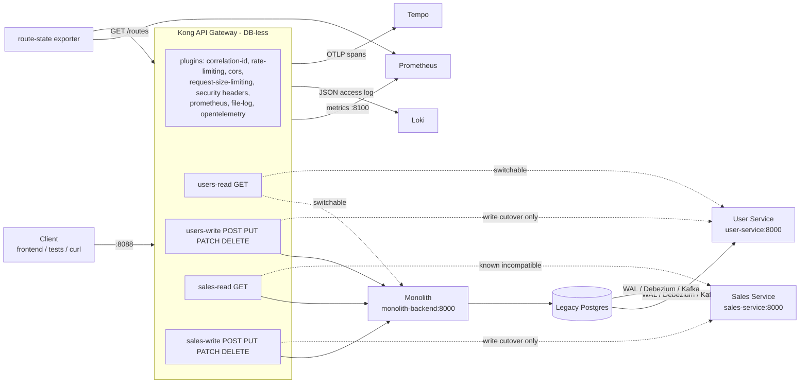

# api-gateway

The single entry point of the Monolith → Microservices lab: **Kong Gateway
OSS 3.9.1 in DB-less mode**. For every **PATH + METHOD** it decides whether
`/users` and `/sales` are served by the **monolith** or by the extracted
**microservice**, so a domain can be strangled (reads first, writes later)
and rolled back **without changing the client, the frontend or the public URL**.

```text
CLIENT ─► KONG :8088 ─┬─ /users  GET ─────────────► monolith | user-service
                      ├─ /users  POST PUT PATCH DEL ► monolith | user-service
                      ├─ /sales  GET ─────────────► monolith | sales-service
                      └─ /sales  POST PUT PATCH DEL ► monolith | sales-service
```

**Default and boot state: every route → monolith.** The monolith is still the
source of truth (CDC flows only monolith → Kafka → microservices). The gateway
never dual-writes and never silently falls back a POST.

## Why an API Gateway?

| | |
|---|---|
| **Strangler Fig** | The routing decision moves out of the clients into one place. A domain moves (or moves back) with one command, and the client keeps the same URL. |
| **Single entrypoint** | The frontend and tests use `http://localhost:8088`. Nobody needs to know which process serves `/users`. |
| **Routing** | Per path *and* method, so **reads can move before writes**. This is the safe first step, since reads are served from the CDC replica. |
| **Security** | Rate limiting, CORS, a request size limit, security headers and request-id hygiene are set once, not per service. |
| **Observability** | One place sees every request: metrics per route/upstream, structured access logs, and the root span of every trace. |
| **Rollback** | Going back to the monolith is a hot reload in seconds, is never blocked, and is audited. |

## Architecture



How a switch works (no restart, no infrastructure change):

```text
routing/profiles/*.json ─┐
kong/kong.template.yml  ─┴─► render ─► POST /config (Admin API, localhost)
                                         │  Kong validates the WHOLE config and
                                         │  swaps it atomically (400 → nothing changes)
                                         ▼
                              verify runtime routes ─► persist state/kong.yml
                                                       + state/routing.json
                                                       + state/history.log
```

A restart boots `state/kong.yml` (the last *applied* routing) if it exists,
otherwise `kong/kong.default.yml` (mode 1). A restart therefore never silently
changes where writes go. The DB-less reload options compared were:

| Option | Verdict |
|---|---|
| **Admin API `POST /config`** | **Chosen.** Atomic, validated before it applies, a hot swap with no dropped connections, sub-second. |
| `kong reload` inside the container | Needs the file changed on a read-only mount plus exec into the container, and gives no validation feedback to the caller. |
| Container restart | Seconds of downtime, and a bad file means a gateway that does not start. Used only as the persistence path (boot reads `state/`). |

Repository layout:

```text
kong/kong.template.yml      the only hand-edited Kong config (4 placeholders = the routing)
kong/kong.default.yml       template rendered with mode 1 (committed, CI checks it is in sync)
kong/entrypoint.sh          picks state/kong.yml or the default at boot
kong-image/Dockerfile       kong:3.9.1 + Ubuntu security updates (non-root 1001)
routing/profiles/*.json     the versioned routing modes
routing/compatibility.json  guards derived from docs/api-compatibility-matrix.md
scripts/*.ps1               operations (Windows PowerShell 5.1 and PowerShell 7)
exporter/                   route-state exporter (stdlib Python)
tests/config                policy tests of every rendered profile (no Docker)
tests/integration           real Kong + scripts vs stub upstreams (isolated network)
state/                      APPLIED routing - local, git-ignored
```

## Start

Prerequisites: the shared network and the backends, started from their own
repos. No `depends_on` crosses projects: Kong starts fine without them and
answers 503 for a backend until its health check passes.

```powershell
docker network create migration-network        # once (already exists in the lab)

# 1. backends (each in its own repo)
cd ..\monolito-microservice; docker compose up -d postgres backend
cd ..\user-service;          docker compose up -d
cd ..\sales-service;         docker compose up -d
# (CDC + observability as usual: cdc-infrastructure, observability-infrastructure)

# 2. gateway
cd ..\api-gateway
docker compose up -d --build --wait
.\scripts\health-check.ps1
```

Ports:

| Port | What | Exposure |
|---|---|---|
| `8088` | **Proxy HTTP**: the only port clients use | host (all interfaces) |
| `127.0.0.1:8089` | **Admin API**: route switches (`POST /config`) | **localhost only**, not proxied, GUI off |
| `127.0.0.1:8090` | **Status API**: `/status`, `/status/ready`, **`/metrics`** | localhost only (Prometheus uses `api-gateway:8100` inside the network) |
| `127.0.0.1:9542` | route-state exporter `/metrics` | localhost only (Prometheus uses `gateway-route-exporter:9542`) |

Frontend: it already reads one variable, `VITE_API_URL`
(`monolito-microservice/frontend/src/api.js`). To send it through the gateway:

```powershell
cd ..\monolito-microservice
$env:VITE_API_URL = 'http://localhost:8088'; docker compose up -d frontend
```

CORS for `http://localhost:5173` is answered by the gateway, including for
user-service and sales-service, which have no CORS of their own.

## Route status

```powershell
.\scripts\route-status.ps1
```

```text
API GATEWAY ROUTING
/users
  GET, HEAD                  -> user-service    [route users-read]
  POST, PUT, PATCH, DELETE   -> monolith        [route users-write]
/sales
  GET, HEAD                  -> monolith        [route sales-read]
  POST, PUT, PATCH, DELETE   -> monolith        [route sales-write]

Profile   : mode-2r-users-reads-service
Persisted : state/routing.json (applied 2026-09-23T23:08:16Z) - in sync
Gateway   : HEALTHY (Kong 3.9.1)
Upstreams : monolith=HEALTHY  user-service=HEALTHY  sales-service=HEALTHY
```

This is read from Kong's **runtime** (Admin API), not from a file, and it is
compared with the persisted state (drift is flagged). Every proxied response
also carries the lab-only header `X-Upstream-Service`.

## Routing modes (versioned)

```powershell
.\scripts\set-routing-profile.ps1 -List
.\scripts\set-routing-profile.ps1 -Name mode-2r-users-reads-service -Reason "reads first"
```

| Profile | users GET | users writes | sales GET | sales writes | Needs |
|---|---|---|---|---|---|
| `mode-1-all-monolith` (**default**) | monolith | monolith | monolith | monolith | - |
| `mode-2r-users-reads-service` | user-service | monolith | monolith | monolith | - |
| `mode-2-users-service` | user-service | user-service | monolith | monolith | `-AcceptWriteDivergence -AcceptIncompatibility` |
| `mode-3r-sales-reads-service` | monolith | monolith | sales-service | monolith | `-AcceptIncompatibility` |
| `mode-3-sales-service` | monolith | monolith | sales-service | sales-service | both flags |
| `mode-4r-all-reads-services` | user-service | monolith | sales-service | monolith | `-AcceptIncompatibility` |
| `mode-4-all-services` | user-service | user-service | sales-service | sales-service | both flags |

Why the flags exist is explained in
[docs/api-compatibility-matrix.md](docs/api-compatibility-matrix.md). In short:
user reads are compatible, while **sales reads are not** (no `user_name`, which
the frontend renders, and a paginated list), and **any write to a microservice
is a write cutover** (no sync back to the monolith). The guards apply only to
routes that *change*, are checked **before** the Admin API is touched, and a
refused change applies nothing.

## Switch users

```powershell
.\scripts\route-users-to-service.ps1                       # GET /users* -> user-service, writes stay on the monolith
.\scripts\route-users-to-monolith.ps1                      # back (reads + writes)
.\scripts\route-users-to-service.ps1 -Scope All -AcceptWriteDivergence -AcceptIncompatibility   # controlled write-cutover TEST only
```

## Switch sales

```powershell
.\scripts\route-sales-to-service.ps1 -AcceptIncompatibility   # GET /sales* -> sales-service (breaks user_name in the UI)
.\scripts\route-sales-to-monolith.ps1
```

Every switch accepts `-Reason "..."` (written to `state/history.log`) and
`-DryRun`.

## Rollback

```powershell
.\scripts\rollback-all-to-monolith.ps1 -Reason "INC-42"      # everything -> monolith, never blocked
```

A route rollback **does not roll back data**. Rows written to a microservice
during a write cutover are not in the monolith. See
[docs/route-rollback-runbook.md](docs/route-rollback-runbook.md) and
[docs/route-cutover-runbook.md](docs/route-cutover-runbook.md).

## Security

| Control | Setting | Why this value |
|---|---|---|
| `rate-limiting` | **100 req/s and 3000 req/min per client IP**, `policy: local` | The E2E and integration suites peak far below 100/s; a 400-request burst proves 429 without hurting anything. Locally all host clients share one Docker IP, so this is effectively per host. `X-Forwarded-For` is not trusted. |
| `request-size-limiting` | 1 MB | Real bodies are ~100 bytes. |
| `cors` | origins `http://localhost:5173`, `http://127.0.0.1:5173`; `credentials: false`; exposes `X-Request-ID` | **Centralised in the gateway.** The monolith's own CORS only matters for direct `:8000` access; its `Access-Control-Allow-Credentials` is stripped so the browser sees one policy. |
| `response-transformer` | `X-Content-Type-Options: nosniff`, `X-Frame-Options: DENY`, `Referrer-Policy: no-referrer`, `Cache-Control: no-store`; `Server` removed | JSON API only. `/docs` (Swagger) is not routed, so no CSP is needed. HSTS arrives with TLS. |
| `correlation-id` + `pre-function` | Keeps a valid client `X-Request-ID`, generates a UUID when absent, replaces malformed ones (>128 chars or outside `[A-Za-z0-9._:-]`) | The backends already honour `X-Request-ID`, so **one id** spans client, gateway and backend logs. Kong's own `X-Kong-Request-Id` is disabled. |
| Routing surface | Only `/users*`, `/sales*`, `/gateway/health` | `/internal/*` (import), `/docs`, `/openapi.json`, `/metrics` and `/health` of the backends are not reachable through the gateway. |
| Upstream calls | `retries: 0`, connect 2 s, read/write 30 s, active health checks | No duplicated POST on retry, and fast controlled 502/503/504 instead of hanging. |
| Admin API | `127.0.0.1:8089` only | See [docs/security-threat-notes.md](docs/security-threat-notes.md). |

There is no JWT/OIDC yet (next phase) and no canary or weighted traffic yet.
The future path is weighted upstream targets (for example 90/10) on read
routes only, driven by the same profiles. Switching is deterministic for now.

## Observability

| | Where | What |
|---|---|---|
| **Metrics** | Prometheus job `api-gateway` (`api-gateway:8100/metrics`) | `kong_http_requests_total{service,route,code,source}`, `kong_request_latency_ms`, `kong_upstream_latency_ms`, `kong_kong_latency_ms`, `kong_upstream_target_health{upstream,state}`. `service` = the upstream that received the request. There are no per-path or per-consumer series (cardinality). |
| **Current routing** | Prometheus job `gateway-route-exporter` | `gateway_route_upstream_info{route,domain,scope,upstream}` and `gateway_route_on_monolith{route}`, read from the Admin API on every scrape, so they are valid with zero traffic. |
| **Dashboards** | Grafana → *API Gateway \| Overview*, *API Gateway \| Strangler Routing*; tiles in *Monolith → Microservices \| Overview* | Gateway UP/DOWN, req/s, 2xx/4xx/5xx, p50/p95/p99, upstream latency, gateway overhead, `/users → ?`, `/sales → ?`, traffic share per destination, and access logs. |
| **Logs** | Loki `{compose_project="api-gateway", service="api-gateway"} \|= "\"log_type\":\"access\"" \| json` | One JSON line per request: `route`, `upstream`, `method`, `path`, `status`, `request_id`, `trace_id`, `latencies.*`, `client_ip`. Request/response headers are **not** logged. `request_id` is a field, **never a label**. |
| **Traces** | Tempo, service `api-gateway` | The `opentelemetry` plugin continues an incoming W3C `traceparent` or starts one, and injects **its own span** as the parent for the backend (verified: `kong → kong.balancer → monolith-backend GET /users/{user_id} → SELECT`). sales-service's HTTP API is not instrumented, so its traces end at the Kong span. |
| **Alerts** | `observability-infrastructure/prometheus/rules` | `ApiGatewayDown`, `ApiGatewayUpstreamUnhealthy`, `ApiGatewayHigh5xxRatio`, `ApiGatewayRouteStateUnknown`. |

Health is checked piece by piece, because "Kong is up" does not imply the
backends are healthy:

```powershell
.\scripts\health-check.ps1
```

```text
Kong proxy                     UP
Kong ready (config loaded)     UP
Admin API (127.0.0.1)          UP

Monolith                       UP
User Service                   UP
Sales Service                  UP  (no route points here)

/users reads route             USER-SERVICE
/users writes route            MONOLITH
...
Prometheus scraping gateway    UP (2/2 targets)

OVERALL                        HEALTHY
```

## Testing

| Layer | Command | What it proves |
|---|---|---|
| Config | `.\scripts\validate-config.ps1` | Every profile renders; **Kong's own parser** (`kong config parse`, same base image) accepts each one; the committed default equals mode 1 and is all-monolith; compose is valid. |
| Config policy | `pytest tests/config` | For every rendered profile: PATH + METHOD split, `preserve_host`, `retries: 0`, health checks, required security/observability plugins and their values, nothing internal routed, Admin/Status ports localhost-only, pinned images, and guards refusing write cutovers **before** touching the Admin API. |
| Integration | `.\scripts\test-integration.ps1` | Real Kong image + config + scripts against **controlled stub upstreams** on an isolated network (`api-gateway-it`, ports 18088+, safe next to the lab). Covers default routing, switch/rollback with the same URL, all four modes, guards, persistence across a Kong restart, the exporter, X-Request-ID (kept / generated / sanitised, seen by the backend), W3C traceparent continuation, security headers, CORS, forwarded-header spoofing, 413, 429 then recovery, unrouted internal endpoints, metrics, and **upstream down → 504/503, logged + counted, no fallback → recovery**. |
| E2E | `migration-e2e-tests` (gateway is the client's entry point) | The real lab through the gateway: create user/sale via Kong → CDC → destination DBs; read switch to user-service with the same URL and the same semantics; rollback; user-service down → controlled error, metric, log, recovery. |

Python deps for the tests: `python -m venv .venv; .venv\Scripts\pip install -e ".[dev]"`.

CI (`.github/workflows/ci.yml`, PR/main, no deploy):
Lint (ruff, ShellCheck, PSScriptAnalyzer, Hadolint) · Validate Config ·
Build (+ Trivy image scan) · Integration. `security.yml`: Gitleaks (full
history), Trivy config, SARIF.
